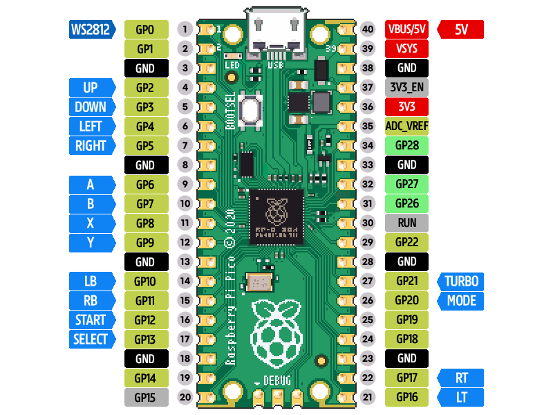

# Pico Gamecon
Pico Gamecon\
Raspberry Pi Pico Game Controller using CircuitPython 7.0

Supports 16 buttons, 4-way Joystick and NeoPixel WS2812B strip
 
## Changelog
- v 1.4
  * Add Mode change button (axis - hat)
  * Add Turbo function (useage: press button to use and press TURBO button simultaneously - button first, not turbo )

- v 1.3
  * Improved Neopixel dimming method
  * Fix HID recognition error on boot (Raspberry pi, android and some windows pc)
- v 1.2 - add config.py
- v 1.0

## How to use
### PINOUT

### Options (configs.py):
- Pin number
- Buttons to use
- Turbo speed
- Neopixel Color, index num., fading speed

### Compatibility
PC, Android, SBC like Rasberry Pi

## License
MIT

## Screenshots

## Videos
